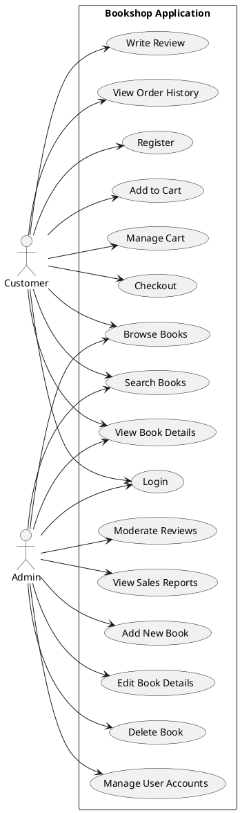
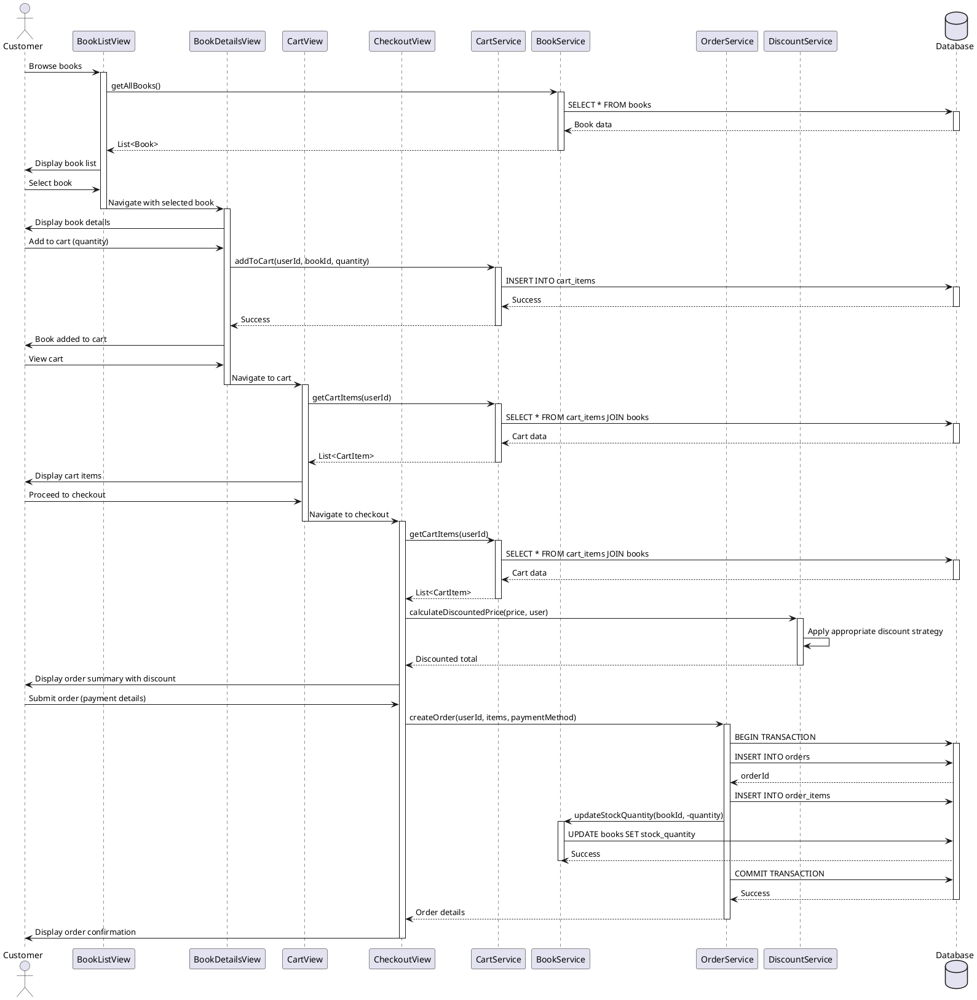
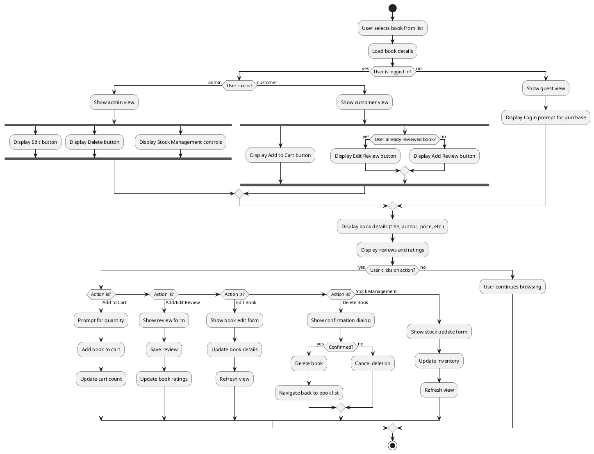

# JavaFX Bookshop Application

## 1. Introduction

- **Purpose of the application**: A comprehensive desktop application for an online bookshop enabling book browsing, purchase, and management
- **Target users**: 
  - **Customers**: Browse books, manage shopping carts, place orders, write reviews
  - **Administrators**: Manage inventory, view customer orders, moderate reviews
- **Technologies used**: 
  - Java 17
  - JavaFX and FXML (for UI construction)
  - PostgreSQL (for persistent data storage)
  - BCrypt (for secure password hashing)
  - Maven (for dependency management and build automation)
  - JUnit 5 and Mockito (for testing)

### 1.1 Theoretical Background

The application employs several key software engineering principles and paradigms:

#### Object-Oriented Programming (OOP)
The entire application is built on OOP principles, leveraging:
- **Encapsulation**: Data and methods are encapsulated within classes with appropriate access modifiers.
- **Inheritance**: Utilized for extending functionality in related classes.
- **Polymorphism**: Employed through interfaces and method overriding, particularly in the discount and payment system.
- **Abstraction**: Complex implementations are abstracted behind clean interfaces.

#### Model-View-Controller (MVC) Architecture
MVC separates the application into three interconnected components:
- **Model**: Represents the data and business logic (Book, User, Order classes).
- **View**: The user interface that displays data (FXML files, JavaFX components).
- **Controller**: Mediates between Model and View (Controller classes that respond to user input).

This separation of concerns allows for better code organization, maintenance, and testing by decoupling the business logic from the presentation layer.

## 2. Architecture

The application follows the Model-View-Controller (MVC) architectural pattern with additional layering to promote separation of concerns and maintainability.

### Project Folder Layout

```
src/main/java/com/bookshop/
├── models/          # Data models (Book, User, CartItem, etc.)
├── controllers/     # JavaFX controllers for FXML views
├── services/        # Business logic and operations
├── repositories/    # Data access layer
├── utils/           # Utility classes (DatabaseConnection, etc.)
├── factory/         # Factory classes for object creation
├── views/           # FXML view files
└── Main.java        # Application entry point
```

### Design Pattern Layering

- **Model Layer**: Represents the application's data objects and business logic
- **Repository Layer**: Handles data storage and retrieval operations
- **Service Layer**: Implements business logic and operations
- **Controller Layer**: Processes user input and updates the view
- **View Layer**: Displays data and receives user input

## 3. Features

### User Authentication
- Login/registration with secure password hashing using BCrypt
- Role-based access (admin and customer)
- Session management for tracking current user

### Book Management
- Comprehensive listing with searching and filtering
- Detailed view for book information
- Role-based interactions:
  - Customers: View details, add to cart, write reviews
  - Administrators: Edit/delete books, manage inventory, moderate reviews

### Shopping System
- Shopping cart management
- Checkout process with multiple payment options
- Order history and tracking

### Review System
- Customers can add reviews with ratings (1-5 stars)
- View aggregated ratings and reviews
- Admin moderation capabilities for inappropriate content

### Loyalty Program
- Automatic discount based on order history:
  - Regular member status (5+ orders)
  - Premium member status (10+ orders)
- Dynamic price calculation reflecting loyalty discounts

### Admin Dashboard
- Book inventory management
- User account management
- Sales data and reporting
- Review moderation

## 4. Design Patterns Used

### GoF Patterns

#### Singleton
- **DatabaseConnection**: Ensures a single database connection throughout the application
- **SessionManager**: Maintains global user session state

```java
public class DatabaseConnection {
    private static DatabaseConnection instance;
    private Connection connection;
    
    private DatabaseConnection() { 
    }
    
    public static synchronized DatabaseConnection getInstance() {
        if (instance == null) {
            instance = new DatabaseConnection();
        }
        return instance;
    }
     
}
```

#### Factory
- **BookFactory**: Creates Book objects from different data sources

```java
public class BookFactory {
    public static Book createBook(ResultSet rs) throws SQLException {
        Book book = new Book();
        book.setId(rs.getInt("id"));
        book.setTitle(rs.getString("title")); 
        return book;
    }
    
    public static Book createBookFromDTO(BookDTO dto) { 
    }
}
```

#### Strategy
- **Payment Processing**: Different payment methods implemented as strategies
- **Discount System**: Various discount calculations based on user loyalty

```java
public interface DiscountStrategy {
    BigDecimal calculateDiscount(BigDecimal originalPrice);
}

public class RegularMemberDiscount implements DiscountStrategy {
    @Override
    public BigDecimal calculateDiscount(BigDecimal originalPrice) {
        return originalPrice.multiply(new BigDecimal("0.10")); 
    }
}

public class PremiumMemberDiscount implements DiscountStrategy {
    @Override
    public BigDecimal calculateDiscount(BigDecimal originalPrice) {
        return originalPrice.multiply(new BigDecimal("0.15")); 
    }
}
```

#### Observer
- **CartObserver**: Components observe shopping cart changes

```java
public interface CartObserver {
    void update(CartEvent event);
}

public class CartManager {
    private List<CartObserver> observers = new ArrayList<>();
    
    public void addObserver(CartObserver observer) {
        observers.add(observer);
    }
    
    public void notifyObservers(CartEvent event) {
        for (CartObserver observer : observers) {
            observer.update(event);
        }
    }
}
```

### Non-Traditional Patterns

#### Repository Pattern
- Abstraction layer for data access operations
- Isolation of database queries from business logic

```java
public interface BookRepository {
    List<Book> findAll() throws SQLException;
    Book findById(int id) throws SQLException;
    int save(Book book) throws SQLException;
    boolean update(Book book) throws SQLException;
    boolean delete(int id) throws SQLException;
}
```

#### Service Layer
- Encapsulates business logic
- Coordinates repository calls and domain objects

```java
public class BookService {
    private BookRepository repository;
    
    public BookService(BookRepository repository) {
        this.repository = repository;
    }
    
    public boolean updateStockQuantity(int bookId, int quantityChange) throws SQLException {
        Book book = repository.findById(bookId);
        if (book == null) {
            return false;
        }
        int newQuantity = book.getStockQuantity() + quantityChange;
        if (newQuantity < 0) {
            newQuantity = 0;
        }
        book.setStockQuantity(newQuantity);
        return repository.update(book);
    }
}
```

#### Scene Manager
- Handles navigation between different application views
- Maintains scene history for back navigation

```java
public class SceneManager {
    private static Map<String, Pane> screenMap = new HashMap<>();
    private static Stack<String> navigationHistory = new Stack<>();
    private static StackPane mainContainer;
    
    public static void setMainContainer(StackPane container) {
        mainContainer = container;
    }
    
    public static void addScreen(String name, Pane pane) {
        screenMap.put(name, pane);
    }
    
    public static void activate(String name) {
        if (screenMap.containsKey(name)) {
            if (!mainContainer.getChildren().isEmpty()) {
                navigationHistory.push(
                    mainContainer.getChildren().get(0).getId()
                );
            }
            mainContainer.getChildren().clear();
            mainContainer.getChildren().add(screenMap.get(name));
        }
    }
    
    public static void goBack() {
        if (!navigationHistory.isEmpty()) {
            String previousScreen = navigationHistory.pop();
            mainContainer.getChildren().clear();
            mainContainer.getChildren().add(screenMap.get(previousScreen));
        }
    }
}
```

## 5. UML Diagrams

### Class Diagram

```plantuml
@startuml
package "Models" {
  class Book {
    -id: int
    -title: String
    -author: String
    -isbn: String
    -publisher: String
    -category: String
    -description: String
    -price: BigDecimal
    -stockQuantity: int
    -imageUrl: String
    +getStockQuantity(): int
    +setStockQuantity(quantity: int): void
    +isInStock(): boolean
    +reduceStock(amount: int): boolean
  }
  
  class User {
    -id: int
    -username: String
    -passwordHash: String
    -fullName: String
    -email: String
    -address: String
    -phoneNumber: String
    -role: String
    -orderCount: int
    +isAdmin(): boolean
    +isRegularMember(): boolean
    +isPremiumMember(): boolean
  }
  
  class CartItem {
    -id: int
    -userId: int
    -bookId: int
    -quantity: int
    -book: Book
    +getSubtotal(): BigDecimal
  }
  
  class Review {
    -id: int
    -bookId: int
    -userId: int
    -rating: int
    -comment: String
    -dateCreated: LocalDateTime
    -user: User
  }
  
  class Order {
    -id: int
    -userId: int
    -orderDate: LocalDateTime
    -totalAmount: BigDecimal
    -status: String
    -paymentMethod: String
    -items: List<OrderItem>
  }
  
  class OrderItem {
    -id: int
    -orderId: int
    -bookId: int
    -quantity: int
    -price: BigDecimal
    -book: Book
  }
}

package "Services" {
  class BookService {
    +getAllBooks(): List<Book>
    +getBookById(id: int): Book
    +addBook(book: Book): int
    +updateBook(book: Book): boolean
    +deleteBook(id: int): boolean
    +updateStockQuantity(bookId: int, change: int): boolean
    +searchBooks(query: String): List<Book>
  }
  
  class UserService {
    +authenticateUser(username: String, password: String): User
    +registerUser(user: User, password: String): boolean
    +getUserById(id: int): User
    +getAllUsers(): List<User>
    +updateUserProfile(user: User): boolean
    +incrementOrderCount(userId: int): boolean
  }
  
  class CartService {
    +getCartItems(userId: int): List<CartItem>
    +addToCart(userId: int, bookId: int, quantity: int): boolean
    +updateCartItemQuantity(cartItemId: int, quantity: int): boolean
    +removeFromCart(cartItemId: int): boolean
    +clearCart(userId: int): boolean
  }
  
  class OrderService {
    +createOrder(userId: int, items: List<CartItem>, paymentMethod: String): Order
    +getOrdersByUser(userId: int): List<Order>
    +getOrderDetails(orderId: int): Order
    +updateOrderStatus(orderId: int, status: String): boolean
  }
  
  class ReviewService {
    +getReviewsByBook(bookId: int): List<Review>
    +addReview(review: Review): boolean
    +deleteReview(reviewId: int): boolean
    +getUserReviewForBook(userId: int, bookId: int): Review
  }
  
  interface DiscountStrategy {
    +calculateDiscount(originalPrice: BigDecimal): BigDecimal
  }
  
  class NoDiscount {
    +calculateDiscount(originalPrice: BigDecimal): BigDecimal
  }
  
  class RegularMemberDiscount {
    +calculateDiscount(originalPrice: BigDecimal): BigDecimal
  }
  
  class PremiumMemberDiscount {
    +calculateDiscount(originalPrice: BigDecimal): BigDecimal
  }
  
  class DiscountService {
    +getDiscountStrategy(user: User): DiscountStrategy
    +calculateDiscountedPrice(price: BigDecimal, user: User): BigDecimal
  }
}

package "Utils" {
  class DatabaseConnection {
    -instance: DatabaseConnection
    -connection: Connection
    +getInstance(): DatabaseConnection
    +getConnection(): Connection
    +initializeDatabase(): void
  }
  
  class SessionManager {
    -instance: SessionManager
    -currentUser: User
    -selectedBook: Book
    +getInstance(): SessionManager
    +setCurrentUser(user: User): void
    +getCurrentUser(): User
    +setSelectedBook(book: Book): void
    +getSelectedBook(): Book
  }
  
  class BCrypt {
    +hashpw(password: String, salt: String): String
    +checkpw(plaintext: String, hashed: String): boolean
    +gensalt(): String
  }
}

' Relationships
Book "1" -- "many" Review
Book "1" -- "many" CartItem
Book "1" -- "many" OrderItem
User "1" -- "many" Review
User "1" -- "many" Order
User "1" -- "many" CartItem
Order "1" -- "many" OrderItem

BookService --> Book
UserService --> User
CartService --> CartItem
CartService --> Book
OrderService --> Order
OrderService --> OrderItem
OrderService --> Book
ReviewService --> Review

DiscountService --> DiscountStrategy
NoDiscount ..|> DiscountStrategy
RegularMemberDiscount ..|> DiscountStrategy
PremiumMemberDiscount ..|> DiscountStrategy

@enduml
```


### Use Case Diagram


### Sequence Diagram – Purchase Flow


### Activity Diagram – Role-Based Book Detail View


## 6. Database Design

### Theoretical Foundation of the Database Schema

The database design follows the **Entity-Relationship (ER) model**, a conceptual representation of data that visually illustrates the relationships between entities in a system. Our schema implements several database design principles:

1. **Normalization** - The database schema is normalized (primarily to 3NF) to:
   - Eliminate data redundancy
   - Reduce data anomalies
   - Ensure data integrity

2. **Referential Integrity** - Enforced through foreign key constraints that ensure relationships between tables remain consistent. For example, the `book_id` in `reviews` must reference a valid id in the `books` table.

3. **ACID Properties** - PostgreSQL's transaction system ensures our operations are:
   - **Atomic**: Transactions are all-or-nothing operations
   - **Consistent**: Data meets all validation rules
   - **Isolated**: Transactions don't interfere with each other
   - **Durable**: Completed transactions persist even during system failures

### Tables Schema

#### users
| Column | Type | Description |
|--------|------|-------------|
| id | SERIAL | Primary key |
| username | VARCHAR(50) | Unique username |
| password_hash | VARCHAR(255) | BCrypt hashed password |
| full_name | VARCHAR(100) | User's full name |
| email | VARCHAR(100) | User's email address |
| address | TEXT | Shipping address |
| phone_number | VARCHAR(20) | Contact phone number |
| role | VARCHAR(20) | User role (ADMIN or CUSTOMER) |
| order_count | INTEGER | Number of orders placed (for loyalty) |

#### books
| Column | Type | Description |
|--------|------|-------------|
| id | SERIAL | Primary key |
| title | VARCHAR(255) | Book title |
| author | VARCHAR(100) | Book author |
| isbn | VARCHAR(20) | ISBN number |
| publisher | VARCHAR(100) | Publisher name |
| category | VARCHAR(50) | Book category |
| description | TEXT | Book description |
| price | DECIMAL(10,2) | Book price |
| stock_quantity | INTEGER | Available quantity |
| image_url | TEXT | Book cover image URL |

#### reviews
| Column | Type | Description |
|--------|------|-------------|
| id | SERIAL | Primary key |
| book_id | INTEGER | Foreign key to books |
| user_id | INTEGER | Foreign key to users |
| rating | INTEGER | Rating (1-5) |
| comment | TEXT | Review text |
| review_date | TIMESTAMP | Review submission date |

#### cart_items
| Column | Type | Description |
|--------|------|-------------|
| id | SERIAL | Primary key |
| user_id | INTEGER | Foreign key to users |
| book_id | INTEGER | Foreign key to books |
| quantity | INTEGER | Quantity in cart |

#### orders
| Column | Type | Description |
|--------|------|-------------|
| id | SERIAL | Primary key |
| user_id | INTEGER | Foreign key to users |
| order_date | TIMESTAMP | Date of order |
| total_amount | DECIMAL(10,2) | Total order amount |
| status | VARCHAR(20) | Order status |
| payment_method | VARCHAR(50) | Payment method used |
| shipping_address | TEXT | Delivery address |
| discount_applied | DECIMAL(5,2) | Discount amount applied |

#### order_items
| Column | Type | Description |
|--------|------|-------------|
| id | SERIAL | Primary key |
| order_id | INTEGER | Foreign key to orders |
| book_id | INTEGER | Foreign key to books |
| quantity | INTEGER | Quantity ordered |
| price | DECIMAL(10,2) | Price at time of order |

### Relationships

- **users** 1:N **reviews** (one user can write many reviews)
- **users** 1:N **orders** (one user can place many orders)
- **users** 1:N **cart_items** (one user has one cart with many items)
- **books** 1:N **reviews** (one book can have many reviews)
- **books** 1:N **cart_items** (one book can be in many carts)
- **books** 1:N **order_items** (one book can be in many orders)
- **orders** 1:N **order_items** (one order contains many items)

## 7. Testing

### Theoretical Approach to Testing

The application employs a multi-layered testing strategy based on software testing principles:

#### Test-Driven Development (TDD)
Our development process follows TDD principles:
1. **Write failing tests**: Create tests that define expected functionality
2. **Write code to pass tests**: Implement the minimum code needed to pass tests
3. **Refactor**: Improve code while maintaining test compliance

#### Testing Pyramid
The testing strategy follows the testing pyramid concept:
- **Unit Tests**: Numerous small, fast tests at the lowest level (classes, methods)
- **Integration Tests**: Testing interactions between components
- **System Tests**: Testing the application as a whole

#### Mocking
The application uses Mockito to create mock objects that simulate dependencies, allowing for:
- Isolation of the component under test
- Testing of components with external dependencies
- Verification of interaction between components

### Areas Tested

- **Model Classes**: Validating business logic within domain models (Book, User, Order)
- **Service Layer**: Testing business logic with mocked repositories
- **Data Access**: Verifying database operations with test database connections
- **Discount Logic**: Confirming discount calculations across different user loyalty tiers
- **Security Functions**: Testing password hashing and authorization logic

### Sample Test Code

```java
@Test
public void testReduceStock() {
    Book book = new Book();
    book.setStockQuantity(10);
    
    boolean result = book.reduceStock(3);
    assertTrue(result);
    assertEquals(7, book.getStockQuantity());
    
    result = book.reduceStock(10);
    assertFalse(result);
    assertEquals(7, book.getStockQuantity());
    
    result = book.reduceStock(-1);
    assertFalse(result);
    assertEquals(7, book.getStockQuantity());
}

@Test
public void testAuthenticateUser() {
    UserRepository mockRepo = mock(UserRepository.class);
    User validUser = new User();
    validUser.setId(1);
    validUser.setUsername("testuser");
    validUser.setPasswordHash(BCrypt.hashpw("password123", BCrypt.gensalt()));
    
    when(mockRepo.findByUsername("testuser")).thenReturn(validUser);
    
    UserService userService = new UserService(mockRepo);
    
    User result = userService.authenticateUser("testuser", "password123");
    assertNotNull(result);
    assertEquals(1, result.getId());
    
    result = userService.authenticateUser("testuser", "wrongpassword");
    assertNull(result);
    
    result = userService.authenticateUser("nonexistent", "password123");
    assertNull(result);
}

@Test
public void testCalculateDiscountedPrice() {
    User regularUser = new User();
    regularUser.setOrderCount(7);
    
    User premiumUser = new User();
    premiumUser.setOrderCount(12); 
    
    User standardUser = new User();
    standardUser.setOrderCount(2);
    
    DiscountService discountService = new DiscountService();
    BigDecimal originalPrice = new BigDecimal("100.00");
    
    
    BigDecimal regularDiscount = discountService.calculateDiscountedPrice(originalPrice, regularUser);
    assertEquals(new BigDecimal("90.00"), regularDiscount);
    
    
    BigDecimal premiumDiscount = discountService.calculateDiscountedPrice(originalPrice, premiumUser);
    assertEquals(new BigDecimal("85.00"), premiumDiscount);
    
    
    BigDecimal standardDiscount = discountService.calculateDiscountedPrice(originalPrice, standardUser);
    assertEquals(originalPrice, standardDiscount);
}
```

## 8. Security

### Theoretical Security Principles

The application implements several key information security principles and best practices:

#### CIA Triad
The fundamental principles of information security:
- **Confidentiality**: Ensuring sensitive data is accessible only to authorized individuals
- **Integrity**: Maintaining data accuracy and reliability throughout its lifecycle
- **Availability**: Ensuring information is available when needed by authorized users

#### Defense in Depth
The application employs multiple layers of security controls:
- **Database Layer**: Parameterized queries to prevent SQL injection
- **Service Layer**: Authorization checks before performing sensitive operations
- **Presentation Layer**: Input validation to prevent XSS and other injection attacks

#### Principle of Least Privilege
Users are granted the minimum levels of access needed to perform their functions:
- Admin users: Full access to manage the system
- Customer users: Limited access to personal data and purchasing functions
- Guest users: Read-only access to public information

### Password Security and Authentication

#### Password Hashing with BCrypt
The application uses BCrypt for secure credential management:

```java
String hashedPassword = BCrypt.hashpw(plainPassword, BCrypt.gensalt());

boolean passwordMatches = BCrypt.checkpw(inputPassword, storedHashedPassword);
```

BCrypt implements multiple security features:
- **Salting**: Automatically generates and stores unique salts with each hash
- **Key Stretching**: Configurable work factor to slow down brute-force attacks
- **Adaptive Complexity**: Can be adjusted as computing power increases

#### Secure Session Management
Sessions are managed securely through the SessionManager singleton:
- Creation upon successful authentication
- Timeout for inactive sessions
- Immediate invalidation upon logout

### Role-Based Access Control (RBAC)

RBAC is implemented across multiple application layers:

#### UI Layer Security
Different interface components are displayed based on user role:
- Admin users see inventory management and user administration controls
- Customers see shopping cart and order history
- All access control is enforced server-side to prevent manipulation

```java
@FXML
private void initialize() {
    User currentUser = SessionManager.getInstance().getCurrentUser();
    
    if (currentUser != null && currentUser.isAdmin()) {
        adminControls.setVisible(true);
        customerControls.setVisible(false);
    } else {
        adminControls.setVisible(false);
        customerControls.setVisible(true);
    }
}

public boolean deleteBook(int bookId) throws SQLException {
    User currentUser = SessionManager.getInstance().getCurrentUser();
    
    if (currentUser == null || !currentUser.isAdmin()) {
        return false;
    }
    
    return bookRepository.delete(bookId);
}
```

## 9. Conclusion

### Summary

The JavaFX Bookshop Application implements a comprehensive solution for online bookshop management. By leveraging the MVC architecture and various design patterns, the application achieves a balance between usability and maintainability.

Key achievements include:
- Well-structured code organization following design best practices
- Secure user authentication and role-based access control
- Comprehensive feature set for both customers and administrators
- Efficient data management with proper database design
- Application of GoF design patterns to solve specific challenges
